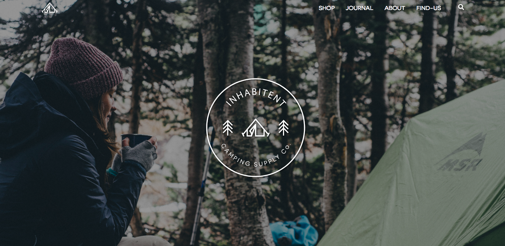

# Inhabitent Project
## This is our inhabitent project for RED academy. It is a mobile-first website made on wordpress with extra custom plug-ins created for multiple uses. 
The website is built with Wordpress, MySql, PHP, SCSS, CSS, HTML, Gulp and Javascript (Jquery).

# Loops
 The website is responsive to changes on the MySql database updates. The loops used on the shop, journal and blogpost tags will automatically catch updates made and fetch them to the page. Multiple loops have been used for specific porpuses.

# Fonts
This project is done by downoloading the founts we are using from google founts and appending it to the project using font-face.

# Structure main files:
    index.html
    style.min.css - min file of multiple sass archives
    main.min.js - min file of main.js
    enqueu.php - file enqueuing important scripts.
    loop-jornal - File controling the loops on the page. Imported on specific php files to use the loop.

# JS
### Javascript(jquery) was used for create a functionin search toggle movement, append and remove items while considering the page height so that the nav menu will change color and for validation of e-mail when using the sign-up for updates form.
    On the validation form JS does the check to see if all the mandatory collums are filled. It also removes the element after submission is completed so that the user can only sign-up once and knows that the submission was successful. The next step would be to work on it linking it to a valid e-mail so that the information is forwarded somewhere.

# Custon Field Types:
### CFS where used to fetch information on different parts of the project. 
    On the main page(front page) it fetched the logo from a custom field on the page.
    On the about page we can fetch the background image and the texts to be used on the page. That also includes the title of the page.
    CFS's were used on the produc custom post type. They are used to input information about the product price, pictures, and description.

# Custom Post Type:
### Custom post Types were used for the strechco goal adventures, for the blog posts and product posts.

# SASS
I had to make some alterations to the wrapping on the first page adventures on the nth child 2 as the link broke when chrome restarted. to fix it I had to add position absolute to the second child div so that the image would be relative to the div and with width 100%.

# License
This project is licensed under the MIT License
